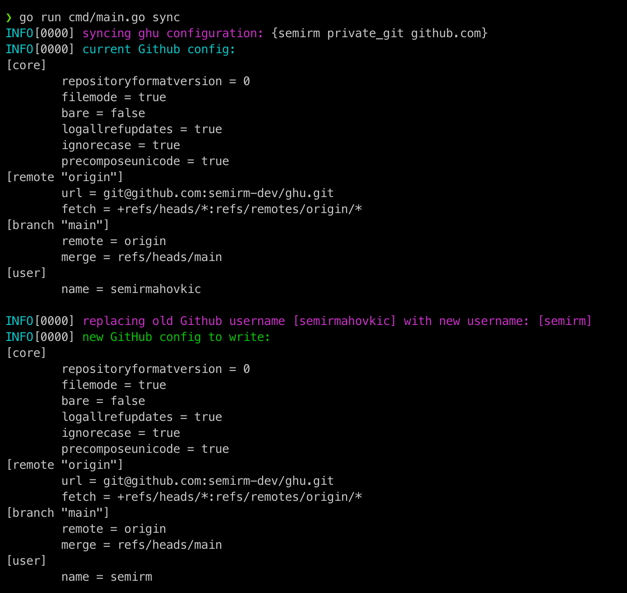

# ghu

Easily change GitHub user and associated ssh key

> NOTE: Call from project's root!

 ```shell 
 $ ghu
 ```

- [x] version
- [ ] show
- [x] set
    - -u [username]
    - -k [sshkey]
- [x] sync
- [ ] delete
    - -u [username]
    - -k [sshkey]
- [ ] generate
    - -p [path]

  
#### GitHub username



#### SSH key


